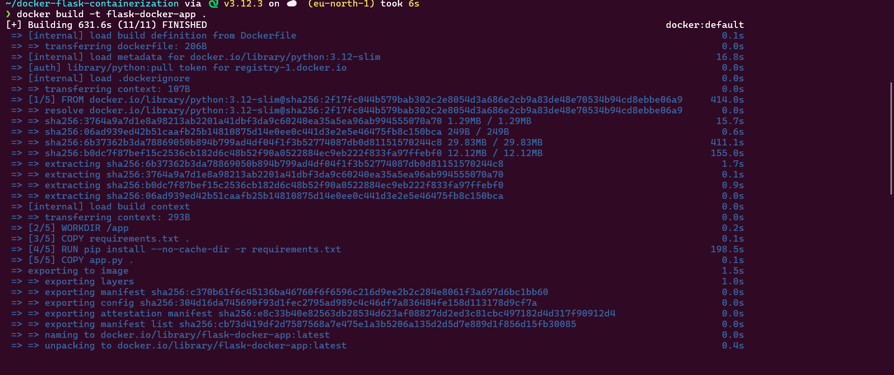
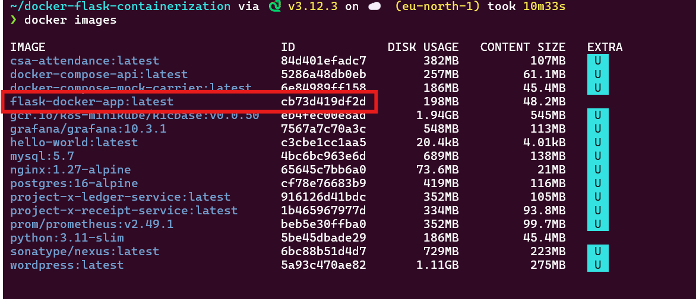
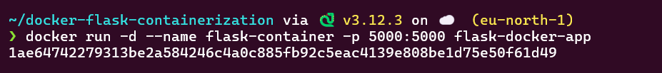
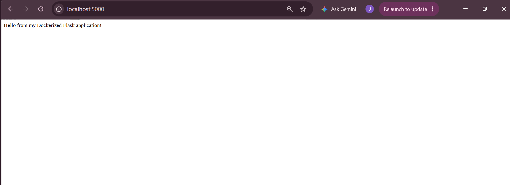
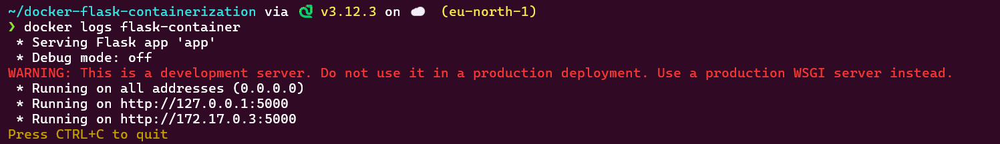
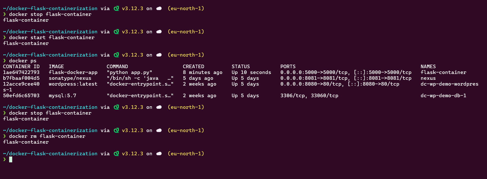

# Docker Containerization – Flask Application

## Overview

This project demonstrates the fundamentals of containerizing a Flask web application using Docker.

The application is packaged together with its Python dependencies into a Docker image, allowing it to run consistently in an isolated container environment.

The project covers Docker image creation, container lifecycle management, port mapping, application monitoring, and basic Docker image optimization.

---

## Project Objectives

* Understand the difference between Docker images and containers.
* Create a Dockerfile to define the application environment.
* Isolate application dependencies using Docker.
* Build and run a Docker image.
* Map a container port to a host port.
* Manage the container lifecycle.
* Monitor the application using Docker logs.
* Apply basic Docker image optimization practices.

---

## Project Structure

```text
docker-flask-containerization/
│
├── app.py
├── requirements.txt
├── Dockerfile
├── .dockerignore
├── README.md
└── screenshots/
    ├── 01-docker-build.png
    ├── 02-docker-images.png
    ├── 03-docker-run.png
    ├── 04-browser-app.png
    ├── 05-docker-logs.png
    └── 06-container-lifecycle.png
```

---

## Technologies Used

* Python
* Flask
* Docker
* Docker Images
* Docker Containers
* WSL/Linux

---

## Flask Application

The application is a simple Flask web server.

The application listens on port `5000` and is configured to accept connections from outside the container.

```python
app.run(host="0.0.0.0", port=5000)
```

---

## Dependencies

The application's Python dependency is defined in `requirements.txt`.

```text
Flask==3.1.2
```

---

## Dockerfile

The Dockerfile defines how the Flask application is packaged into a Docker image.

```dockerfile
FROM python:3.12-slim

WORKDIR /app

COPY requirements.txt .

RUN pip install --no-cache-dir -r requirements.txt

COPY app.py .

EXPOSE 5000

CMD ["python", "app.py"]
```

### Dockerfile Explanation

| Instruction             | Purpose                                           |
| ----------------------- | ------------------------------------------------- |
| `FROM`                  | Specifies the Python base image                   |
| `WORKDIR`               | Sets the working directory inside the container   |
| `COPY requirements.txt` | Copies the dependency file into the image         |
| `RUN pip install`       | Installs the application dependencies             |
| `COPY app.py`           | Copies the Flask application                      |
| `EXPOSE`                | Documents the port used by the application        |
| `CMD`                   | Defines the command used to start the application |

---

# Building the Docker Image

The Docker image was built using:

```bash
docker build -t flask-docker-app .
```

The `-t` option assigns the image the name `flask-docker-app`.

### Build Evidence



---

# Verifying the Docker Image

The created image was verified using:

```bash
docker images
```

### Evidence



---

# Running the Container

The Flask application was started as a detached container using:

```bash
docker run -d --name flask-container -p 5000:5000 flask-docker-app
```

The port mapping:

```text
5000:5000
```

maps port `5000` on the host machine to port `5000` inside the Docker container.

### Evidence



---

# Accessing the Application

After starting the container, the Flask application was accessed through a web browser at:

```text
http://localhost:5000
```

The application successfully responded through the mapped host port.

### Browser Evidence



---

# Monitoring Container Logs

The application's output was monitored using:

```bash
docker logs flask-container
```

This command displays the logs generated by the Flask application running inside the container.

### Evidence



---
## Multi-Stage Docker Build

The Dockerfile uses a multi-stage build to separate dependency installation from the final runtime image.

The first stage installs the Python dependencies:

```dockerfile
FROM python:3.12-slim AS builder

## Docker Security

The application runs as a non-root user inside the container.

```dockerfile
RUN useradd --create-home appuser
USER appuser

# Container Lifecycle Management

The Docker container lifecycle was tested using the following commands.

### Stop the container

```bash
docker stop flask-container
```

### Start the container again

```bash
docker start flask-container
```

### Verify the running container

```bash
docker ps
```

### Stop the container

```bash
docker stop flask-container
```

### Remove the container

```bash
docker rm flask-container
```

These commands demonstrate the basic Docker container lifecycle: running, stopping, restarting, and removing containers.

### Evidence



---

# Docker Image Optimization

The Dockerfile applies several basic optimization practices.

### Lightweight Base Image

The project uses:

```dockerfile
FROM python:3.12-slim
```

The `slim` image provides a smaller Python environment than the standard Python image, reducing unnecessary image size.

### Layer Caching

The dependency file is copied before the application source code:

```dockerfile
COPY requirements.txt .

RUN pip install --no-cache-dir -r requirements.txt

COPY app.py .
```

This allows Docker to reuse the dependency installation layer when only the application source code changes.

### No Pip Cache

The installation uses:

```bash
pip install --no-cache-dir
```

This prevents pip from storing its package cache inside the image.

### `.dockerignore`

A `.dockerignore` file is used to prevent unnecessary files such as virtual environments, Python cache files, Git metadata, and screenshots from being included in the Docker build context.

---

# Key Docker Concepts Demonstrated

## Docker Image

A Docker image is a read-only template containing the application, runtime, dependencies, and configuration required to create a container.

## Docker Container

A container is a running instance of a Docker image.

In this project:

```text
flask-docker-app
        │
        ▼
flask-container
```

The image provides the blueprint, while the container provides the running application environment.

---

# Conclusion

This project demonstrates how a Flask application can be packaged into a portable Docker container.

The implementation covers image creation, dependency isolation, port mapping, container lifecycle management, application logging, and basic image optimization.

Containerization provides a reproducible environment that reduces dependency conflicts and helps applications run consistently across different environments.
